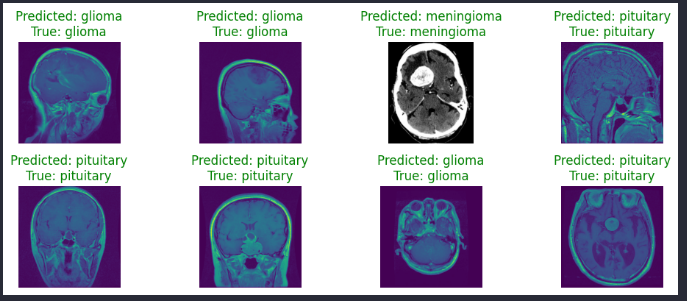
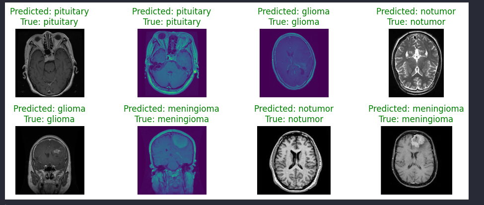

# Brain Tumor Classification

## Overview
This project focuses on classifying brain tumors using machine learning techniques. The objective is to develop models that can accurately identify various types of brain tumors from medical imaging data.

## Table of Contents
- [Installation](#installation)
- [Dataset](#dataset)
- [Models](#models)
- [Results](#results)

## Installation
To get started, clone the repository and install the required dependencies:

```bash
git clone https://github.com/yourusername/BrainTumorClassification.git
cd BrainTumorClassification
pip install -r requirements.txt
```

## Dataset

### What is a Brain Tumor?
A brain tumor is a collection of abnormal cells in the brain. The rigid skull encloses the brain, so any growth inside this restricted space can cause problems. Brain tumors can be cancerous (malignant) or noncancerous (benign). Growth of these tumors can increase pressure inside the skull, potentially causing brain damage and being life-threatening.

### Importance of the Subject
Early detection and classification of brain tumors are crucial in medical imaging, aiding in selecting the most appropriate treatment method to save patients' lives.

### About the Dataset
This dataset combines three sources:
- figshare
- SARTAJ dataset
- Br35H

It contains 7023 MRI images of human brains, classified into four categories: glioma, meningioma, no tumor, and pituitary.

## Models

### Heavy Model
- **Architecture**: 
    - **Convolutional Layers**: 3 layers with filters of size 64, 128, and 256
    - **Activation**: ReLU
    - **Pooling**: Max pooling
    - **Dense Layers**: 3 layers
    - **Output Layer**: 4 neurons with softmax activation
- **Purpose**: Achieve higher accuracy
- **Categories**: Glioma, Meningioma, No Tumor, Pituitary

### Lite Model
- **Architecture**: 
    - **Convolutional Layers**: 3 layers with filters of size 64, 128, and 256
    - **Activation**: ReLU
    - **Normalization**: Batch normalization
    - **Regularization**: Dropout layers
    - **Pooling**: Global average pooling
    - **Dense Layers**: 2 layers
    - **Output Layer**: 4 neurons with softmax activation
- **Purpose**: Lower Size, Faster Inference
- **Categories**: Glioma, Meningioma, No Tumor, Pituitary

### Common Features
- **Optimizer**: Adam
- **Loss Function**: Cross-entropy
- **Evaluation Metric**: Accuracy

## Training Results

### Heavy Model


### Lite Model


## Results

### Heavy Model

### Lite Model

